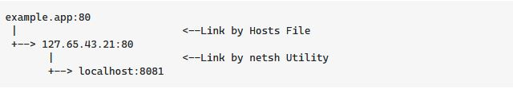

# Host

- [Port proxy](#port-proxy)
- [Host file](#etchost)

## Windows

### Port proxy

- Using `netsh` tool (link stackoverflow: `https://stackoverflow.com/questions/8652948/using-port-number-in-windows-host-file`)
- Overview

  
- Action
  - Start server/app (e.g: localhost:8081)
  - Add my "local DNS" in ***host file***
    - 127.10.1.1    exmaple.com
    - Be sure 127.10.1.1 is not used yet, check by `netstat -a -n -p TCP | grep "LISTENING"`
  - add `netsh interface portproxy add v4tov4 listenport=80 listenaddress=127.10.1.1 connectport=8081 connectaddress=127.0.0.1`
  - Access `http://example.com` -> `http://localhost:8081`
- See all entry: `netsh interface portproxy show v4tov4`
- Remove entry: `netsh interface portproxy delete v4tov4 listenport=80 listenaddress=127.10.1.1`

### /etc/host

- locate at `C:\Windows\System32\drivers\etc\hosts`
- Flush the DNS and NetBIOS Cache
  - `nbtstat -R`
